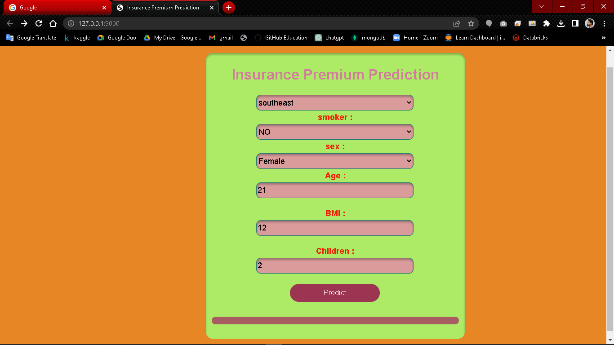
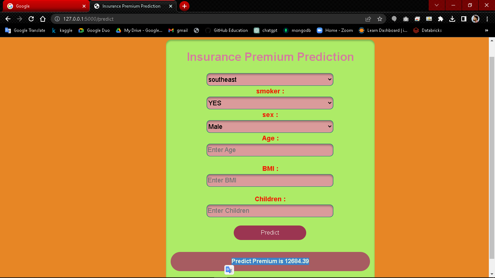

# insorance-Premium-Prediction
i build a end to end CI/CD pipeline for this project. code written in modular fashion.
and finally created a flask Api, to get the prediction.
entire code written in python Oop. Data loaded from mongodb, and all the generated logs. are saved in the logs directory, and all the artifacts of the projects saved
in the artifacts directory.

## steps to Run this project
1. install all the dependencies
2. run the train.py file
3. run the main.py

## steps to run API
1. install all the dependencies
2. run the python app.py
3. copy the url and paste into your favourate browser.
4. fill all the input, and click on the the predict button.

## webframe architecture design or Api Design

<b>Api displaying the prediction.<b>

## to install dependency
pip install -r requirements.txt

## while run the train.py file
it will execute entire training pipeline and model will get trained.
and entire pipeline will be executed, if you will execute the train.py file.

## while run the main.py
while you will execute the main.py it will execute the batch_prediction function
and prediction will be stored in the prediction directory with timestamp.csv,

## Keep points
1. if you will run the main.py file then it will run the batch_prediction Function.
   But when you will run the train.py file, then it will execute the training pipeline.

2. i added new functionality in the batch_predicter function,
   there is one parameter inside the batch_predicter function, which is database,
   if you will set database = True, then it will take data from mongodb. if you will
   set database = False, then it will take the data for the batch_prediction from
   the current working directory. 

### Thank You 📣